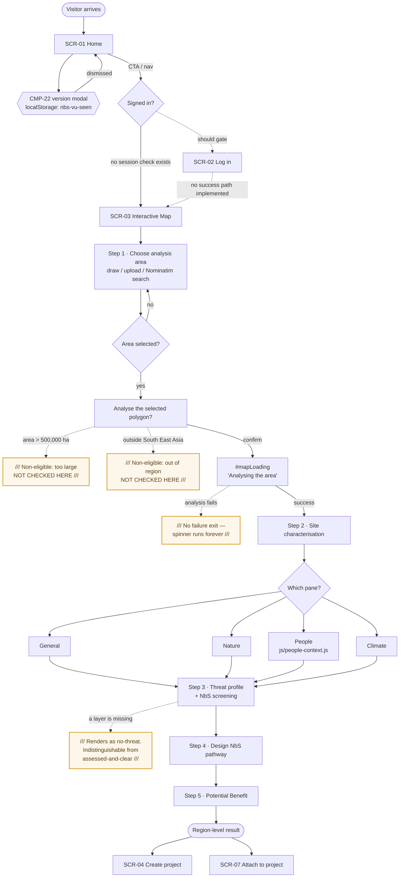
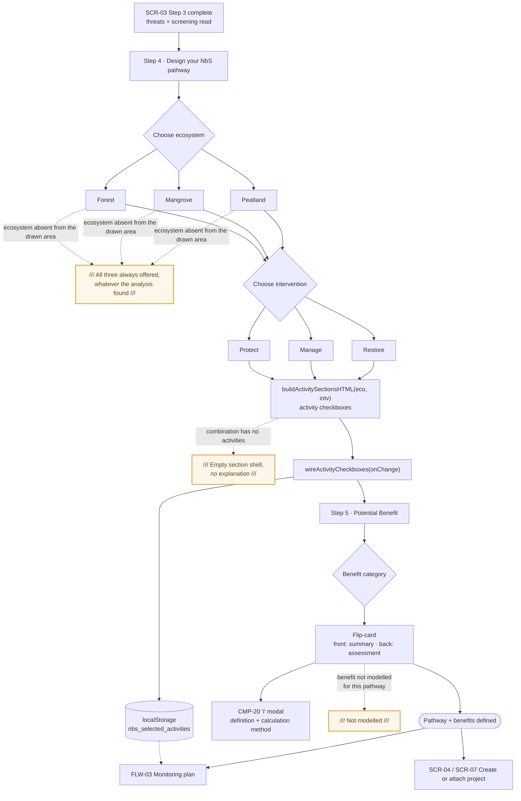
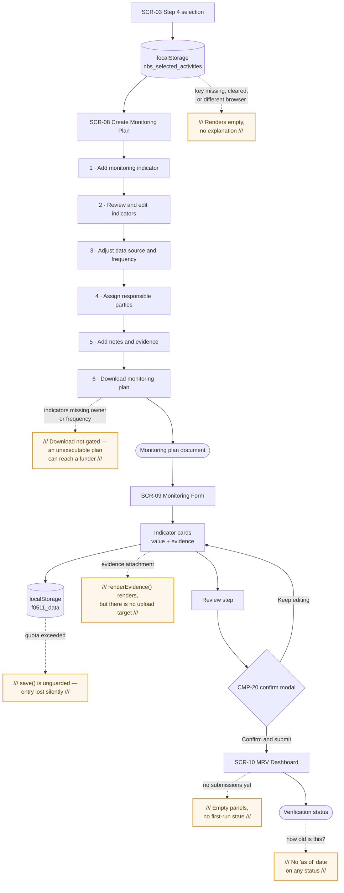
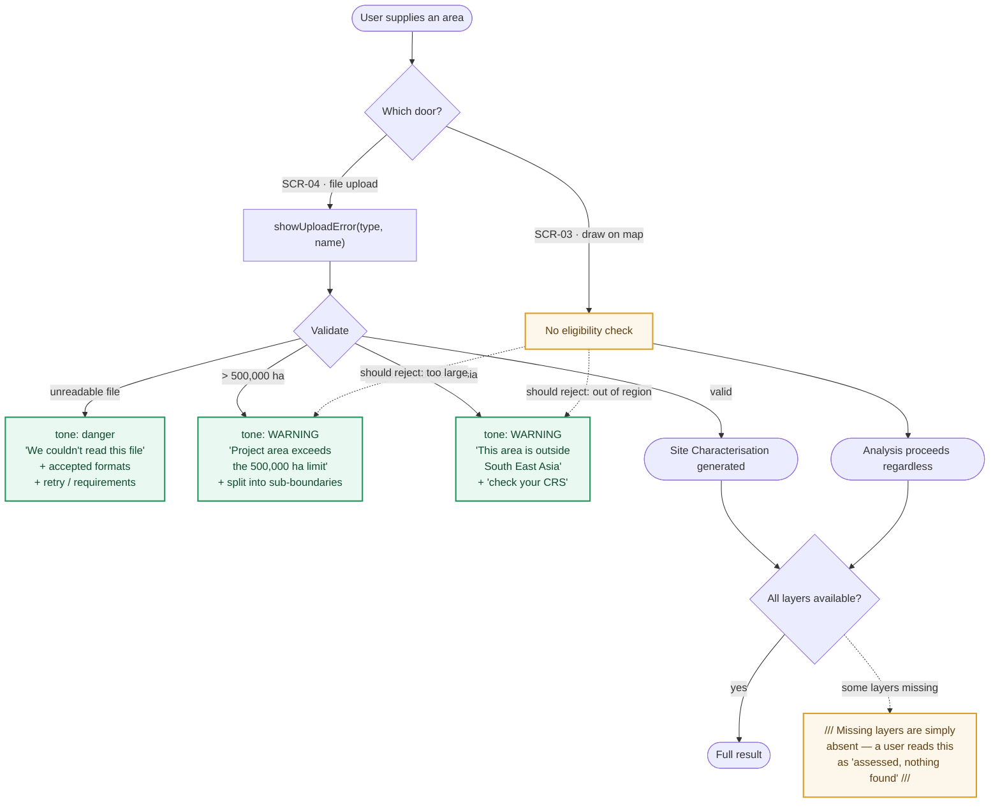
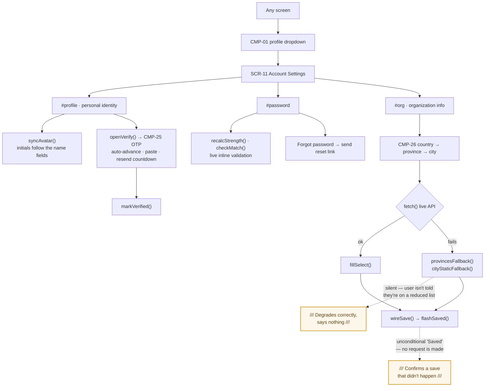

# FLOWS.md — user journeys

Derived from the actual link graph (`href`s in the nav, footer, breadcrumbs and CTAs), the
`data-step` state machines, and the `localStorage` handoffs between screens.

Screen IDs are from [SCREENS.md](SCREENS.md). `FLW-` IDs are stable.

**Convention in these diagrams.** Solid arrows are paths that exist in the code. **Dashed
arrows are branches that should exist but don't** — every one of them corresponds to a
`TODO(design)` in [UI-STATES.md](UI-STATES.md).

---

## FLW-01 · First load → region-level result

The primary journey: a visitor arrives, scopes an area, and reads its baseline.

### Walkthrough

1. **SCR-01 Home.** Entry from a direct link, the coalition site, or search. On first visit
   CMP-22 fires over the page, gated by `localStorage` key `nbs-vu-seen`. If storage is
   unavailable it fires every time.
2. **The auth branch does not exist.** No screen performs a session check, so a visitor reaches
   SCR-03 whether or not they've been through SCR-02. Both dashed arrows are
   `TODO(design)`.
3. **SCR-03 Step 1.** Three ways to define an area: draw on the map, upload a boundary, or
   search a place through Nominatim (whose failure is silent — no `.catch()`). Confirmation
   runs through "Analyse the selected polygon?".
4. **The two eligibility branches are missing here.** SCR-04 rejects areas over 500,000 ha and
   outside South East Asia, with warning-toned copy that names the likely cause. SCR-03 applies
   neither rule. **The same product rule has two different answers depending on which door the
   user came through.**
5. **Analysing.** `#mapLoading` covers the map with a spinner and "Analysing the area". There is
   no timeout and no error branch — a failed analysis spins indefinitely.
6. **SCR-03 Step 2.** Four context panes switched by `nbsShowSitePane()`. People Context is
   rendered by a separate module with its own SVG charts. Every card carries a source-and-year
   line and an "i" affordance.
7. **SCR-03 Step 3.** Threats ranked by section; Overview shows every section. A missing layer
   is not distinguished from an assessed-and-clear one — the most consequential gap in the
   flow, because it changes what a user believes about their site.
8. **SCR-03 Step 4 → Step 5.** Pathway design feeds benefit estimation. Step 4 writes
   `localStorage` key `nbs_selected_activities`, which FLW-03 depends on.
9. **Exit.** Either create a project (SCR-04) or attach the result to an existing one (SCR-07).

**State is not addressable.** `data-step` lives only in the DOM. A reload restarts the flow and
a result cannot be bookmarked, linked or shared — which for a tool whose output is meant to
persuade a funder is a workflow problem, not a technical one. See CMP-05.

---

## FLW-02 · Intervention selection

Steps 4 and 5 in detail — where a site becomes a plan.

### Walkthrough

1. **Entry from SCR-03 Step 3.** The user has read the threat profile and screening overview.
2. **Ecosystem.** Forest, mangrove or peatland. **All three are always offered**, regardless of
   what the analysis found in the drawn area — so the tool will happily let someone plan
   mangrove restoration on a site with no mangrove. That's a credibility problem, and it's the
   most important dashed branch in this diagram.
3. **Intervention.** Protect, manage or restore. The pair (ecosystem, intervention) selects the
   activity set through `buildActivitySectionsHTML()`.
4. **Activities.** Rendered as checkboxes and wired by `wireActivityCheckboxes(onChange)`.
   Selection is written to `localStorage` under `nbs_selected_activities`.
5. **SCR-03 Step 5.** Benefit categories as flip-cards. Both faces are measured and the card
   sized to the taller, and each tab remembers its own scroll position — the most carefully
   engineered interaction in the analysis flow.
6. **The "i" modal** reads its content off the card markup itself (`[data-def]`, `.formula
   code`, `data-method`), so the card stays the single source of truth. Good pattern; see
   CMP-20.
7. **Exit.** Either into FLW-03 to build a monitoring plan, or into project creation.

**The handoff is fragile.** `nbs_selected_activities` is the only link between this flow and
SCR-08, and it is a browser-local key with no expiry, no versioning and no ownership. See
FLW-03.

---

## FLW-03 · Plan → monitor → verify

What happens after a pathway exists.

### Walkthrough

1. **The handoff.** SCR-08 reads `nbs_selected_activities`. If the user opens the screen
   directly, cleared their storage, or switched browser, the wizard renders with no indicators
   and no explanation. This will happen constantly in real use.
2. **SCR-08 steps 1–5.** Indicators, then source and frequency, then responsible parties, then
   notes and evidence. Indicator metadata (methodology, sampling frequency) comes from
   `js/f05-shared.js`.
3. **SCR-08 step 6 — download.** Builds a print-ready document inline. **Nothing gates
   completeness**: an indicator with no responsible party produces a plan nobody can execute,
   and the document downloads anyway.
4. **SCR-09 Monitoring Form.** Field entry against the plan's indicators, with per-group filled
   counts. Values persist to `localStorage` under `f0511_data`.
5. **Two data-loss paths.** `save()` has no try/catch, so a quota error loses the entry
   silently; and `renderEvidence(id)` renders attachments that have nowhere to upload to. On the
   screen most likely to be used offline, in the field, recording observations that cannot be
   repeated.
6. **Submit.** A confirmation modal states how many of the total indicators are filled, then
   goes to SCR-10.
7. **SCR-10 MRV Dashboard.** Verification status and results — with no first-run state (every
   project starts here empty) and no date on any status.

---

## FLW-04 · Non-eligible and missing-data branches

The two branches that decide whether this tool is trustworthy, collected in one place because
they are handled inconsistently across the product.

### Walkthrough

1. **Two doors, one rule, two answers.** An area over 500,000 ha or outside South East Asia is
   rejected on upload (SCR-04) and accepted on the map (SCR-03).
2. **The upload path is the model.** Note what it does right: **`area` and `region` are
   `tone: 'warning'`, not `danger`.** Being out of scope is a product rule, not a user error,
   and the UI says so in colour before it says so in words. The `region` case even names the
   probable cause — a wrong CRS placing a valid site outside the region.
3. **The map path does neither check.** Fix by applying both rules at confirm time and reusing
   the SCR-04 copy verbatim, so the two doors give the same answer in the same words.
4. **Missing layers are the quieter problem.** Absent is not the same as zero. Anywhere a layer
   could be unavailable, it must render an explicit "Not assessed" marker in its own place.
   Hiding it converts "we don't know" into "there's nothing there".

`TODO(design): unify the eligibility rules across SCR-03 and SCR-04 — same thresholds, same tone, same copy.` **Blocking.**
`TODO(design): specify the "Not assessed" treatment for a missing layer, distinct from a zero result, and apply it in Steps 2, 3 and 5.` **Blocking.**

---

## FLW-05 · Account and settings

Included because it contains the only real network path in the product.

### Walkthrough

1. **Entry** from the profile dropdown on any signed-in screen.
2. **Three sections** with a scroll-spy rail: identity, password, organisation.
3. **Password** has live strength and match checking — the best inline validation in the
   product.
4. **Email verification** runs the OTP flow (CMP-25): auto-advance, backspace, paste support and
   a resend countdown. The most complete interaction in the codebase.
5. **The location cascade** is the only genuine third-party dependency, and the only place a
   network failure is handled: it falls back to static lists. It does so silently, though — a
   user seeing five provinces instead of thirty-eight has no idea why.
6. **Every save flashes "Saved" unconditionally.** No request is made, so none can fail. When a
   backend lands these must become pending → success → failure; confirming a save that didn't
   happen is worse than not confirming at all.
